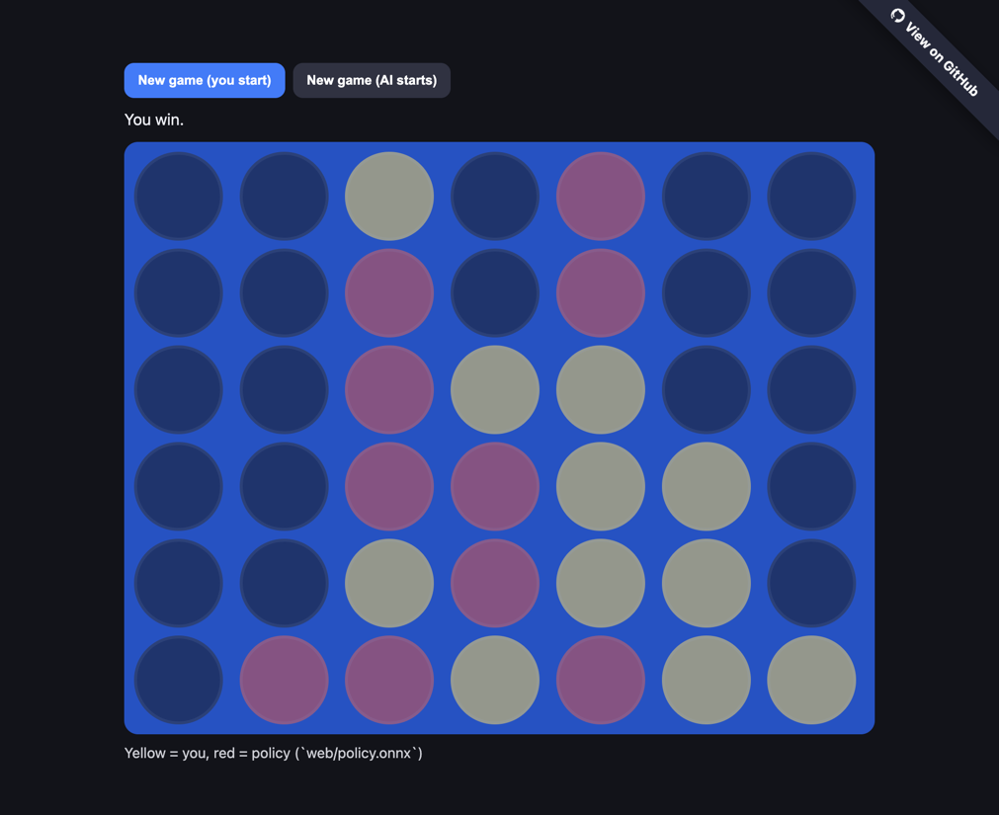

# RL Connect-4

This is my first important RL project to test my [shiny new RL certificate](https://digitalcredential.stanford.edu/check/B292F634C9E029D15DDEC09E41EEE4C0BD530FC1EBF9A0883544731EDE16BE72cy9ZQjNTYk50dTZRWWp0SDRWSlVLUjBJM2JYeTFlOVhvK1V3ZU5NRjBBbnNzMWVq), and was a long-standing ambition to build an AI agent to play Connect-4.

It includes both the ML project to train a model, as well as a simple web app that lets you play against the model online.

The online game is available [here](https://yann-j.github.io/rl-connect4).



The objective was of course not to build the best Connect-4 agent (this is a solved game that tree search can exhaustively explore), but a personal challenge to explore RL techniques.

the result is an agent is decent but I was hoping for stronger result (I'm still tuning it).

This was developed from scratch but heavily inspired from the following references to get me started (though I ended up with very different choices):

- [Connect Zero](https://codebox.net/pages/connect4)
- [Clément Brutti-Mairesse](https://clementbm.github.io/project/2023/03/29/reinforcement-learning-connect-four-rllib.html)
- [AgileRL Tutorial](https://docs.agilerl.com/en/latest/tutorials/pettingzoo/dqn.html)

## General architecture

- [PettingZoo](https://pettingzoo.farama.org/index.html) play environment (`connect_four_v3`)
- [Stable-Baselines3](https://stable-baselines3.readthedocs.io/en/master/) + sb3-contrib `MaskablePPO` RL framework
- PPO algorithm with legal action masking policy
- ML model using:
  - Residual CNN feature extractor (stack of 3x3 conv blocks)
  - Policy/value MLP heads on top of extracted features
- Simple sparse terminal reward (`-1/0/+1`), since games are quite short/finite
- Training against a mix of opponents:
  - Self (or recent historical checkpoints)
  - Random policy
  - Monte-Carlo Tree Search (MCTS) policy (playing N games and picking best action) with increasing strength (to keep a learning gradient)
  -PUCT
- All hyperparamter configuration in [`configs/train.yaml`](configs/train.yaml), including curriculum of increasingly strong opponent mix
- TensorBoard metrics for reward and win-rate baselines

## Learnings (for me!)

### Appropriate Opponent pool

Getting the general RL algorithm was pretty straightforward, but getting the policy to actually learn well required a lot of tuning and experimentation, in particular in selecting appropriate opponents that would be just the right (increasing) strength to provide a useful learning gradient:

- Self-play alone can be unstable (since the reward can either select a strong player policy, or a weak opponent policy - hence the use of historical checkpoints)
- Non-self opponents need an appropriate strength:
  - Random helps for the very first few iterations but is quickly useless
  - MCTS works well for a while, especially since we can tune adjust its strength (number of simulated games), but also plateaus (100% policy wins) after ~200k timesteps
  - A more capable policy based on PUCT, an enhancement of MCTS that uses the network's action selection priors to explore the best trajectories

The training is organized in a curriculum, a series of phases with a different mix of opponents of increasing (but appropriate) strength. Getting this curriculum right took a lot of experimentation (watching the eval reward metrics against each opponent class).

### Leagues

The literature often recommends running a regular selection among the recent model checkpoints to select the best, to make sure we always keep improving. This was implemented by running a regular league tournament between N recent checkpoints + current model, computing an ELO-style score for each model after having them all play each other X times...

In practice this didn't really seem to help, since the selected checkpoint almost always seemed to be the latest one, but it was a good metric to track just to make sure we keep learning.

### Rewards

I originally used a trivial terminal reward (+1 for wins, -1 for losses, 0 for draws). This worked fine up to a certain point, allowing the agent to easily beat MCTS fairly quickly, but I was then stuck in a limbo where MCTS opponents were too easy (always getting +1 reward), but PUCT were too strong (always getting -1). I felt this was not providing a good enough gradient to learn, and implemented a terminal bonus based on the speed of the wins/losses, equivalent to the ratio of empty cells on the board (therefore always between 0 and 1), to reward fast wins slightly more, and penalize fast losses slightly more. I thought this would allow to learn even from slightly better losses against a strong opponent.

This seemed to help, but not as much as I thought.

### Hardware

All the training was done on my Macbook. I tried renting GPUs on [Thundercompute](https://thundercompute.com) but it wasn't much faster, most likley because the training involves a lot of rollouts (game simulations) which run on cpu and not on CUDA...

## CI

The CI on this repo will run the training (while exposing a Tensorboard UI to watch learning metrics) and then deploy the webapp to Github Pages.

The Tensorboard logs from the CI runs are summarized in a static report also published in Github Pages [here](https://yann-j.github.io/rl-connect4/tensorboard).

Training takes several hours on the default Github runners (cpu), so CI is run on AWS GPUs managed via [RunsOn](https://runs-on.com/), which are much cheaper than GitHub GPUs.

To quickly disable training in CI while keeping Pages deploy active:

- Set repository variable `CI_DISABLE_TRAINING=true` (global kill switch)
- Or trigger the workflow manually and set `run_training=false` (one-off skip)

## Quickstart

```bash
python -m venv .venv
source .venv/bin/activate
pip install -e ".[dev]"
python scripts/train.py --config configs/train.yaml
```

## TensorBoard

```bash
tensorboard --logdir runs
```

## Fully static web game (ONNX in browser)

Export the trained policy to ONNX (so it can be loaded in the browser):

```bash
python scripts/export_policy_onnx.py \
  --model checkpoints/<run_name>/final_model.zip \
  --output web/policy.onnx
```

Then serve the `web/` folder with any static file server:

```bash
python -m http.server 8000 --directory web
```

or:

```bash
npx serve -p 8000 web
```

Open `http://127.0.0.1:8000` and play directly in the browser (inference runs
client-side with `onnxruntime-web`).
